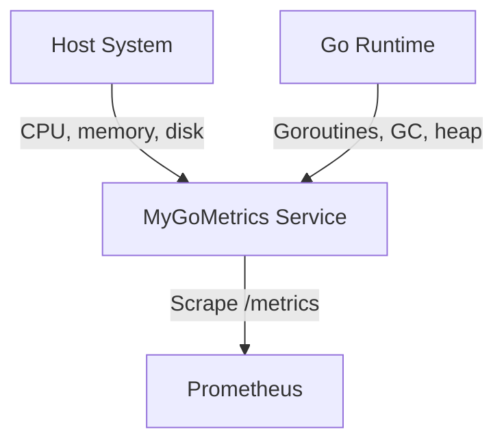
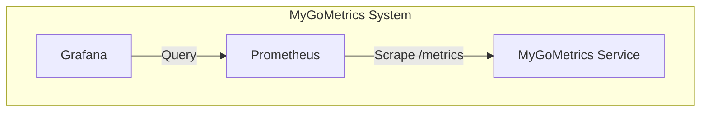

# Architecture Documentation

This document describes the architectural decisions, design patterns, and execution model of the **MyGoMetrics** Prometheus exporter service.

**Related Documentation**: [Configuration](./CONFIGURATION.md) | [Running](./RUNNING.md) | [Decisions](./DECISIONS.md)

---

## High-Level Design

The system is a single Go service that collects host-level system metrics and Go runtime metrics, aggregates them in a Prometheus registry, and exposes them via an HTTP `/metrics` endpoint for Prometheus scraping.

**Core Principles**:
- Stateless design — no internal database; metrics are collected on-demand or at a fixed interval
- Collector-based architecture — independent collectors for each metric source
- Prometheus-agnostic collectors — data collection decoupled from exposition
- Graceful shutdown and lifecycle management

**Technical Constraints**:
- **Language**: Go 1.25+ for the service
- **Metrics**: Prometheus client library (exposition format)
- **Deployment**: Docker containers and/or Kubernetes (Helm chart)
- **Communication**: HTTP server with `/metrics` and `/healthcheck` endpoints
- **Observability**: Structured logging (zap), Prometheus metrics exposition

---

## System Context



**Actors**: Prometheus (or any scraper) that polls the `/metrics` endpoint; operators who monitor the service  
**External Systems**: Optional Prometheus for scraping; optional Grafana for dashboards (see [OBSERVABILITY.md](./OBSERVABILITY.md))

---

## Container Architecture



**Service Details**:
- **MyGoMetrics**: Prometheus exporter; collects system and runtime metrics, serves `/metrics` and `/healthcheck`
- **Prometheus**: Metrics collection and storage (scrapes MyGoMetrics)
- **Grafana**: Dashboards for visualization (optional, for local or full observability stack)

**Infrastructure**:
- MyGoMetrics is a single process; no internal persistence
- Prometheus and Grafana use persistent volumes when deployed (see [RUNNING.md](./RUNNING.md), [OBSERVABILITY.md](./OBSERVABILITY.md))

---

## Service Internal Structure

The service follows a layered architecture:

```
MyGoMetrics/
├── cmd/                    # Entry point (main.go)
├── internal/
│   ├── config/             # Configuration loading (flags, env, .env)
│   ├── collector/          # Metric collectors (cpu, memory, disk, runtime)
│   ├── exporter/           # Prometheus registry and metric mapping
│   ├── logger/             # Structured logging (zap)
│   └── server/             # HTTP server (/metrics, /healthcheck)
├── grafana/                # Grafana dashboard definition
├── helm/                   # Helm chart for Kubernetes deployment
├── prometheus/             # Prometheus alert rules
└── docs/                   # Documentation
```

---

## Data Flow & Interaction Patterns

### Key Patterns

1. **Periodic Collection**
   - A ticker runs at `CollectInterval` (default 15s)
   - On each tick, the registry runs all enabled collectors and updates Prometheus gauges/counters
   - Collectors are independent; one failure does not block others (partial results are written)

2. **Collector → Snapshot → Registry**
   - Collectors return `[]Snapshot` (name, value, optional labels) — no Prometheus types in collectors
   - The exporter layer maps snapshot names to Prometheus metrics (`mygometrics_*`) and updates the registry
   - Labels `host` and `env` are applied from configuration

3. **On-Demand Exposition**
   - Prometheus (or any client) scrapes `/metrics`; the handler serves the current registry state
   - No buffering of scrapes; each scrape reads the latest collected values

4. **Graceful Shutdown**
   - Context cancellation (SIGINT/SIGTERM) stops the ticker and triggers server shutdown
   - HTTP server shutdown timeout (10s) allows in-flight scrapes to complete

### Example Flows

**Scrape**: Prometheus HTTP GET `/metrics` → server → registry handler → Prometheus text format response

**Collection cycle**: Ticker fires → `registry.Update(ctx)` → each collector `Collect(ctx)` → snapshots → `metricHolders.updateMetric` → Prometheus gauges/counters updated

**Health check**: HTTP GET `/healthcheck` → 200 OK `{"status":"ok"}`

---

## Deployment & Infrastructure

**Orchestration**: Docker (single container) or Kubernetes via Helm chart (`helm/mygometrics`)

**Persistence**: MyGoMetrics does not persist data; Prometheus and Grafana (when used) use their own volumes

**Scaling**: Single MyGoMetrics instance per host (or per pod); typical use is one exporter per node for host-level metrics. Horizontal scaling is by deploying more instances behind discovery (e.g., Prometheus scrape config or ServiceMonitor).

**Configuration**: Flags and environment variables (see [CONFIGURATION.md](./CONFIGURATION.md))

**Running Locally**: See [RUNNING.md](./RUNNING.md) for build and execution instructions.

---

## Quality Attributes

### Performance
- Fixed collection interval prevents unbounded CPU use
- Collectors run in sequence per cycle; collection time should stay well below `CollectInterval`
- HTTP server uses reasonable timeouts (read/write 15s, idle 60s)

### Reliability
- Per-collector errors are logged; other collectors still update (partial results)
- Graceful shutdown ensures server drains before exit
- Health check endpoint supports liveness probes (e.g., in Kubernetes)

### Observability
- Structured logging (JSON) via zap; level configurable via `LOG_LEVEL`
- Prometheus metrics: `mygometrics_cpu_usage_percent`, `mygometrics_memory_used_bytes`, `mygometrics_memory_total_bytes`, `mygometrics_disk_read_bytes`, `mygometrics_disk_write_bytes`, `mygometrics_runtime_goroutines`, `mygometrics_runtime_gc_cycles`, `mygometrics_runtime_heap_alloc_bytes` (all with `host`, `env` labels)
- `/metrics` endpoint for Prometheus scraping (default port 9000)
- Grafana dashboard and Prometheus alert rules provided (see [OBSERVABILITY.md](./OBSERVABILITY.md))

---

## Technology Stack

**Language**: Go 1.25+

**Key Libraries**:
- Metrics: `prometheus/client_golang`
- System metrics: `shirou/gopsutil/v3`
- Go runtime metrics: `runtime/metrics` (standard library)
- Logging: `go.uber.org/zap`
- Config: `joho/godotenv`

**Infrastructure**: Docker, Kubernetes (Helm), Prometheus, Grafana (optional)

---

## Architecture Decision Records

Key architectural decisions are documented in [DECISIONS.md](./DECISIONS.md). Summary:

1. **Host-level scope**: System and Go runtime metrics only; not a full observability agent
2. **Collector-based architecture**: Independent collectors; enable/disable by name; isolated failures
3. **Prometheus-agnostic collectors**: Snapshots (name, value) instead of Prometheus types; mapping in exporter layer
4. **Metrics sources**: Go standard library and gopsutil for system; `runtime/metrics` for Go runtime
5. **Environment-based configuration**: Flags and env vars with explicit precedence (flags > env > defaults)
6. **Graceful shutdown**: Context cancellation and HTTP server shutdown with timeout
